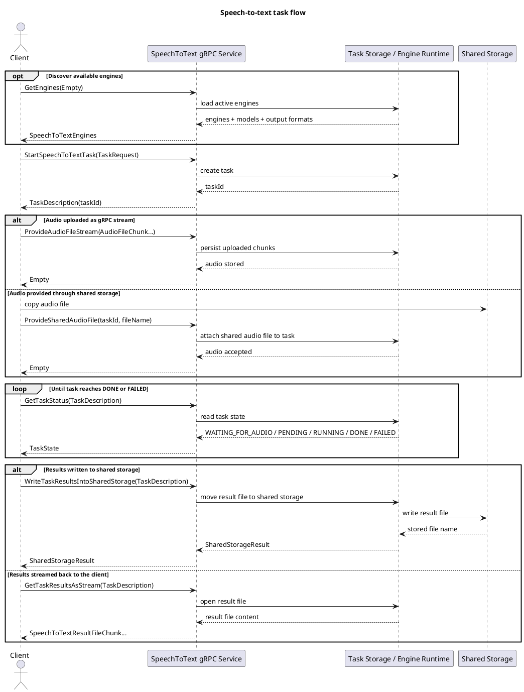

# speech-to-text-service-protocol

## Overview
`speech-to-text-service-protocol` contains the shared gRPC and Protocol Buffers contract for the
speech-to-text system. The module defines the RPC surface, task lifecycle messages, engine and
output format enums, and the payloads used to transfer audio and transcription results between the
client and the service.

During the Maven build, the `.proto` definition is compiled into Java protobuf classes and gRPC
stubs that are consumed by both `speech-to-text-service` and `speech-to-text-service-client`.

## Main RPCs
- `StartSpeechToTextTask` creates a new transcription task and returns its `taskId`.
- `ProvideAudioFileStream` uploads audio chunks directly to the service.
- `ProvideSharedAudioFile` references an audio file that already exists in shared storage.
- `GetTaskStatus` returns the current task state.
- `WriteTaskResultsIntoSharedStorage` exports the completed result file into shared storage.
- `GetTaskResultsAsStream` streams the completed result file back to the client.
- `GetEngines` lists the currently available speech-to-text engines and models.

## Sequence Diagram

